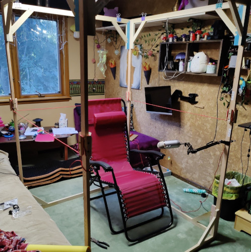
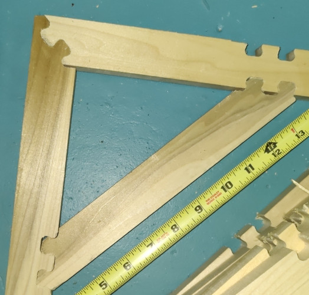
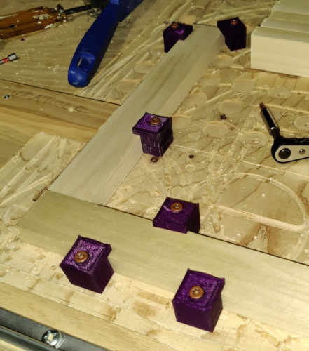

## Portable Home Audio Isolation Booth
a.k.a., Rob's blanket fort.

### Abstract

CNC files, bill of parts, and design description for
a booth, suitable for personal vocals 
recording, that can be set up or broken down for
storage/transport in about ten minutes.

The only exceptional feature of this design is the CNC
cut joinery. If you're just here for that,
[jump to the joinery](JOINERY.md). 

The joinery is also the impetus for me making 
it available online. With simple joinery, it is almost 
always necessary to put the peices in a jig while glue dries,
or while nails/screws/pegs are inserted. These joints require
a CNC router to cut, but can be carelessly whacked together, 
with angular accuracy being determined when you position 
the parts on the router table.

With this technique, I was able to achieve stiff squares
that allowed me to stack the top half of the assembly on 
the lower half, with the ends of the three foot verticals 
varying by less than a half inch.

### Description

These are the design artifacts for a small (4' x 4' x 6') 
padded space suitable for recording vocals. It can be set 
up or broken down in less than ten minutes, and the frame 
stores in a space 4' x 15" x 7". It is slightly larger and 
many time sturdier than the popular $500 pop-up booths online.

#### Considerations
This is not a sound-proof booth. It is designed to absorb
the echos of your own voice, not to keep your neighbor's 
lawnmower from ruining your recordings. It is an alternative
to permanently dedicating a space by hanging curtains or 
acoustic tiles for proper sound deadening. You will still 
need to find a quiet space, but that space can be your 
living room, and it'll still be available for watching TV
in the evening.

This booth is scaled for me to be able to sit down while
I record. Most people will prefer to stand, but that doesn't
work for me for health reasons.

It's optimized for quick single-person set-up and 
tear-down, and for low storage size. It's durable 
enough to travel with. 

You can do this cheaper with PVC pipe, but there are 
trade-offs. After you've cut the parts, it takes
as much effort to tear down and re-assemble every time
you do it. It's never as stable as I would like it to be,
and sometimes the joints just don't want to stay joined. 

Based on these criteria, this design is best suited for
the materials + construction + setup + maintenance. Your
mileage may vary.

## Requirements
### CNC Router

The design does require cutting the structural members
with a CNC router. Yes, those are 3d printed tabs. You can 
do this on a bed 15"x15" if one axis can support 
four-foot boards hanging off the edge.

Other things that came in handy were my miter saw, drill
press, and hand router, but if you have a CNC router
handy, those aren't a great leap.

### Materials
This presumes a 4'x4'x6' enclosure, but you may 
want one that's 18"x18"x7', so adjust accordingly. The minimum
upper bar length is around 8 inches, but anything less than
22 would require you to adjust the cad drawings. For 
those who don't hang around lumberyards for fun and profit,
a 1x2 is .75" x 1.5".

* 26 feet of hardwood 1x2's
* 70 feet of softwood 1x2's
* 32 1" wood screws
* 32 [hidden cabinet hooks with screws](https://www.amazon.com/gp/product/B09NSDLTST) (see note below)
* 25 feet of paracord
* Roughly 130 square feet of moving blankets. More if you don't have a carpeted space
* 12 extra large (1-inch) binder clips

I've included links to examples of some of the products, 
not because I think you should purchase them from anyone
in particular, but because I wouldn't know what someone 
else meant by the words "hidden cabinent hooks with screws."

I built this from 1x2's because they're ubiquitous
at Home Depot. My softwood is poplar, and my hardwood is oak.
If you go with a softer wood for the vericals, let me know how it turns out.
I briefly considered hickory, but I know I can keep oak splinters
out of my hand with a 1/4" roundover and a little sandpaper.

This project came into existence because I'm planning
to do the audiobook recording for Dystopia: Clempson
Goes to Hell. I don't have a space for which I can pad the 
walls, so I made movable pads.  You might notice that the 
images show the booth set up in various rooms in the house.

## Framing
### Brackets
The frame involves eight cross-braced structural members 
that look like angle brackets [ ] with a diagonal across each
corner. Each face of the frame has a top bracket and a bottom
bracket.

The joins on the angle brackets are cut with a CNC router. 
I trimmed the part to length on a miter saw. 11" worked 
out for the diagonals. I also cut the verticals to 11", 
but if I did this again, I'd cut them at 13.5" because 
it would make the final product pack better.

There are five attached dfx files that need to be 
converted into gcode.

#### The raw puzzle join
I plan to use this for numerous future projects. 
It is designed to be cut with a 1/4" end mill bit.

Use of this pattern involves: 
* creating diagrams of the two parts you want to join 
* moving the digrams so that they're overlapped in the 
manner you want them to be joined in the real world.
* copying the puzzle join pattern onto the two pieces
* moving one of the peices away from the other
* copying the puzzle join, offset by the amount you just moved the one part 
* trimming extraneous lines
* Making a closed curve of the cutout parts of the puzzle

#### The puzzle join applied to horizontal and vertical members
Note that the horizontal and vertical parts will also need
cutouts for the diagonal part. I found it easist to cut these
in a single operation, with jigs to assure perpendicular 
alignment.

#### The puzzle join applied to the diagonal
After separating this from the horizontal and vertical parts,
I turned it so that the wood could be aligned with the X axis
of the router.

#### The sockets for the hidden cabinet anchor plates

This cut requires a 1/8" end mill bit.

Once you've cut the puzzle join into the verticals, you will
need to flip them on their side and cut these sockets.
You'll want to measure the plates and screws of your 
hidden cabinet mounts and cut the slot deep enough for
the screw heads.

When cutting the socket, you want to be sure that you're
offsetting them from the end with the corner puzzle
join.

The screw holes will only
need to be cut marginally deeper than the plate, to make it 
easier to get them properly aligned. DO NOT cut the screw
holes as deep as the entire length of the screw unless 
you're making the brackets out of hardwood. Softwood screws 
need the extra material to grip properly.

In the original design, I mounted the ancor plates on half
of the brackets upside-down so the corner posts bore the 
entire weight of the brackets. This was more trouble than it
was worth. Mount the plates on both sides so that the bracket
sits slightly beyond the edge of the supports, then slides 
towards the middle to lock into place.

##### Considerations
I am not happy with the strength of #6 screws for this 
application. I have not been able to find #8 screws
with a head small enough that it doesn't stick up, scraping
the vertical support when connected.  I'm pretty sure that 
the right solution would be to use hardwood throughout,
but I like the lighter weight brackets.

### Vertical supports
Six foot long vertical supports seemed like they would 
be difficult to store, so I split the supports into a
3.5' section and a 2.5' section. this also helped them fit 
on the router table. 

Each of the eight sections will need two pairs of screws.
You need to plan the placement of the screws so that the 
brackets will make a square. 

#### The sockets for the hidden cabinet anchor screws
This also requiresa 1/8" end mill bit.

It sounds like a good idea to just drill the holes with
a drill press, but they'll have identical spacing if you
bore them with the CNC router. This is helpful for making 
the brackets level and interchangeable.

Unlike softwood screws, hardwood screw holes need to be cut 
with just enough clearance that the screw isn't loose in
the hole. I had .25" screws, and cut the holes at .23",
and would probably go .235" if I did it again.

#### Vertical join
Having chopped the verticals in half, I was now facing
the issue of making them stay together after assembly.
The solution I came up with was a socket that provided 
cleat hitches on all four sides.

There might be an easier way to do this, but I like the
results. It makes it easy to use a single length of paracord
to tie the vertial supports together.

#### Monday morning quarterbacking
I was thinking that the verticals needed to exist as 
right-front, left-front, right-rear, left-rear, 
which doubled the number of CNC patterns required. 
It also resulted in a final product that was .75" 
longer in one dimension than the other. Yea,
picky, picky.

I could have made all of the screw holes on the verticles
interchangeable by giving the corners rotational symmetry
instead of bilateral symmetry (image to describe this).

## Drapes
For the actual echo-preventing part, I used nondescript
moving blankets. Two layers of moving blankets is pretty
good at muffling echos. I attaching them to the horizontal 
brackets via oversized binder clips.

Getting a 6x7 blanket to stay in place over the 4x4 hole 
in top, but I clipped the ends to a spare 1x2.

